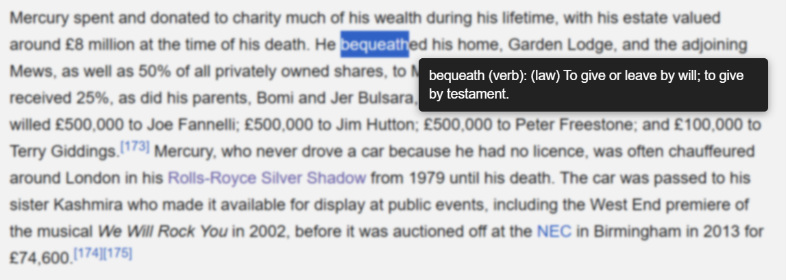

# Page Dictionary

Page Dictionary is a Chrome extension that lets you freeze the current page, highlight any word, and instantly see its meaning in a tooltip – without opening a new tab or losing your reading flow.

There were many moments while reading articles, blogs, and documentation where an unfamiliar word appeared, and looking it up meant switching tabs, searching, and then trying to regain focus. Page Dictionary was created to remove that friction and keep reading continuous and distraction‑free.

---
## Keyboard Shortcut

Page Dictionary now supports a convenient keyboard shortcut!

**Default shortcut:**  
`Ctrl` + `Shift` + `Z` — toggles dictionary mode on any page.

- You can use this shortcut instead of clicking the extension icon.
- To change the shortcut, go to [`chrome://extensions/shortcuts`](chrome://extensions/shortcuts) in your browser.

---

## Usage

1. Click the Page Dictionary toolbar icon **or** press `Ctrl+Shift+Z` to activate dictionary mode.
2. The page will dim and an “Exit dictionary mode” button appears.
3. Select any word to see a tooltip with its definition.
4. Click the tooltip to dismiss it, or click “Exit dictionary mode” to return the page to normal.

## Features

- Freeze the current page with one click.
- Highlight any word and get its definition in a small tooltip near the selection.
- Uses FreeDictionaryAPI (Wiktionary‑based) for rich definitions.
- Clean, minimal UI with a simple on/off “dictionary mode”.

---

## Screenshots

Word highlighted with an inline definition tooltip:

---

## How it works

The extension is built using Chrome Extensions Manifest V3:

- `manifest.json`  
  - Declares the extension’s metadata (name, description, icons).  
  - Requests required permissions (`activeTab`, `scripting`) and `host_permissions` for `https://freedictionaryapi.com/*`.  
  - Registers the background service worker and the toolbar action icon.

- `background.js`  
  - Runs as a service worker.  
  - Listens for clicks on the extension icon.  
  - Injects `content.js` into the currently active tab when the icon is clicked.

- `content.js`  
  - Toggles “dictionary mode” by dimming the page and showing an exit button.  
  - Listens for text selections (mouse up / double‑click).  
  - Calls the FreeDictionaryAPI endpoint  
    `https://freedictionaryapi.com/api/v1/entries/en/<word>`  
    and parses `entries[0].senses[0].definition` and `partOfSpeech`.  
  - Renders the definition in a tooltip near the selected word and cleans up when dictionary mode is exited.

---

## Installation (Unpacked)

1. Clone this repository
2. Open Chrome and go to `chrome://extensions/`.
3. Enable **Developer mode** (top‑right toggle).
4. Click **Load unpacked** and select this project folder.
5. Pin **Page Dictionary** from the extensions menu so the icon is always visible.

---

## Plans

Planned enhancements include:

- Keyboard shortcut to toggle dictionary mode without clicking the icon.
- Showing examples, synonyms, and multiple senses from the API, not just the first definition.
- Support for additional languages where FreeDictionaryAPI provides data.
- Local caching of frequent lookups to reduce API calls and speed up repeated queries.
- Basic offline support using a small bundled dictionary for common words.
- Customization options (tooltip theme, font size, position, and behavior).

---

## Tech stack

- Chrome Extensions, Manifest V3
- JavaScript (background and content scripts)
- FreeDictionaryAPI (Wiktionary‑based) for dictionary data

---

